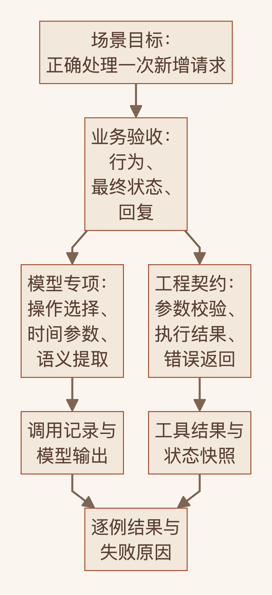
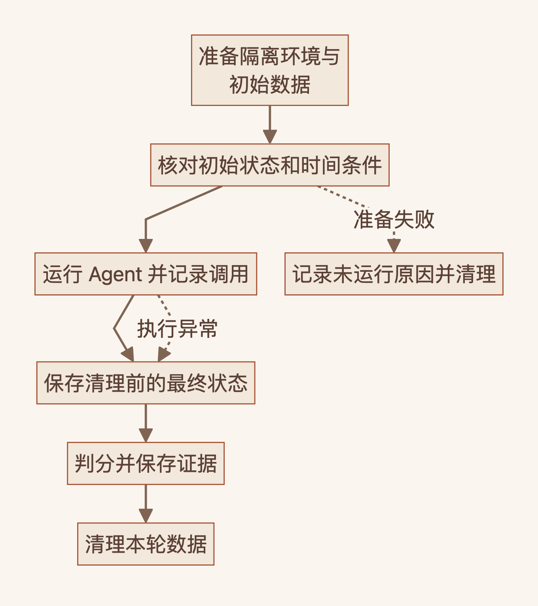
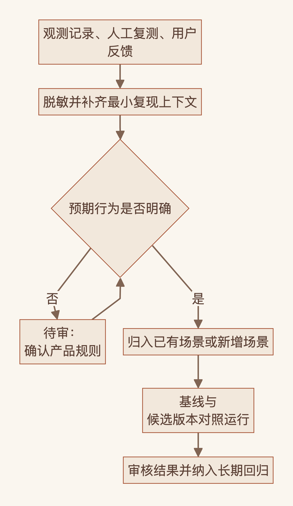

{
  "title": "从验收目标到评测集：Agent 场景化评测的构建方法",
  "author": "Echo",
  "description": "以新增日程为例，从场景目标拆解验收条件、指标、工程诊断与业务评测，形成可逐批扩充的评测集构建流程。",
  "date": "2026-09-19T22:25:31+08:00",
  "slug": "agent-eval-datasets",
  "draft": false,
  "tags": [
    "Agent",
    "评测",
    "工程实践"
  ],
  "echoArticle": true,
  "ShowToc": true,
  "TocOpen": false,
  "ShowReadingTime": true,
  "ShowCodeCopyButtons": true
}

「明天上午九点半安排需求讨论。」

「明天帮我安排需求讨论。」

同样是新增日程，前一句应该直接创建，后一句需要追问开始时间。如果评测只看有没有调用日程工具，就会把后一种正确行为判成失败。

再加一句「把『明天上午九点半安排需求讨论』翻译成英文」，时间、主题、动作都出现了，但这次根本不应该创建日程。

评测集构建的起点，就藏在这些差别里。一个功能期望完成什么，什么条件下执行，什么条件下澄清，什么条件下保持不操作，需要先有明确答案。

Anthropic 在 [Agent 评测文章](https://www.anthropic.com/engineering/demystifying-evals-for-ai-agents)里已经提出了这些原则：尽早定义成功标准，围绕特定能力组织评测，一个任务可以有多个判分项，同时覆盖行为应该发生和不应该发生的情况。我想继续展开的是，这些原则落到一个具体功能上，怎样一步步变成可维护的评测集。

我把自己评测方案中的分层思路抽出来，用日程管理作为通用案例。文中的样例均为合成示例，用来说明构建方法，尚未运行模型，也不包含效果提升数据。

## 1. 场景目标决定首批评测范围

日程管理通常包含新增、查询、修改、删除，还会涉及重复日程、时间冲突、跨轮指代。每项都能继续拆，首批就追求完整覆盖，很容易失去重点。

这里先选定一个目标。

**用户能正确新增一个日程；信息不足时得到必要的追问；没有创建意图时不会发生误操作。**

这句话还需要落到具体规则。本例约定：主题、日期、开始时间充分时直接创建，不再二次确认；缺少主题或开始时间时先澄清；用户指定的地点应保留。未指定的可选字段允许省略，默认值需要有明确的产品规则。

首批限定中文、单个一次性日程、一次用户输入。一次输入之后，Agent 内部可以执行多个步骤。重复日程、冲突处理、过去时间和跨轮指代暂不纳入这一版。

边界确定后，按影响行为和参数的条件拆场景。

| 场景 | 代表输入 | 预期行为 |
| --- | --- | --- |
| A01 明确日期与时间 | 帮我新增 2026 年 9 月 20 日下午三点的项目评审 | 创建，保留明确的日期与时间 |
| A02 相对日期 | 明天上午九点半安排需求讨论 | 创建，依据参考时间解析「明天」 |
| A03 相对时长 | 半小时后安排项目复盘 | 创建，依据参考时间计算开始时间 |
| A04 指定地点 | 明天下午三点在 A 会议室开项目评审，帮我加入日程 | 创建，保留地点 |
| N01 明确禁止创建 | 不要把明天下午三点的项目评审加进日程 | 不执行写操作 |
| N02 引用日程语句 | 把「明天下午三点安排项目评审」翻译成英文 | 完成翻译，不执行写操作 |
| B01 缺少开始时间 | 明天帮我安排项目评审 | 追问开始时间，不写入 |
| B02 缺少主题 | 明天下午三点帮我建一个日程 | 追问主题，不写入 |

这些是决策条件。把「安排」换成「帮我安排」，通常只是同一场景下的表达变体；把明确时间去掉，期望行为发生变化，就形成了新的边界。

这张表是本例对首批核心体验的选择，尚未经过真实流量频次验证。实际项目可以结合需求、使用记录和失败记录调整优先级。像「我明天有个会」这种表达，如果产品还没确定应当记录还是只作回应，就先留在待确认列表里。规则未定的输入，暂时无法提供可信的标准答案。

## 2. 从单例验收到指标定义

有了场景，还不能直接开始算准确率。要先写清楚，一条用例怎样才算通过。

沿用「明天上午九点半安排需求讨论」，固定参考时间为 `2026-09-18 10:00`，时区为 `Asia/Shanghai`。在本例中，新增操作使用 `schedule_manager`，通过 `type=add` 区分于查询、修改和删除。

| 检查项 | 本例的通过条件 |
| --- | --- |
| 操作 | 执行新增，不索要已有信息，也不增加无必要的确认 |
| 参数 | 日期为 `2026-09-19`，时间为 `09:30`，主题表达「需求讨论」的含义 |
| 最终状态 | 恰好新增一条符合预期的日程，原有记录保持不变，没有额外写入 |
| 过程约束 | 不发出本例禁止的修改、删除操作 |
| 回复 | 有实际成功证据后再报告成功，内容与执行结果一致 |

只看到工具返回「成功」，还不足以证明记录正确；日期和时间都对，主题却被写成别的会议，也不能通过。业务验收需要把这些条件合起来检查。

换成「明天帮我安排需求讨论」，通过条件随之改变：追问开始时间，不重复询问已经提供的主题和日期，不发出写操作，已有数据不变。这里的一次正确追问，就是本轮应该完成的目标。

**一个评测集绑定明确的验收目标，这个目标可以包含多项判定条件。**

因此，首批结果应分别呈现新增、澄清、不操作三组场景通过率。每组的分子都是满足该组全部验收条件的执行次数，分母都是该组已开始执行的次数。

再补充用于定位问题的指标。

| 诊断指标 | 统计口径 | 能回答的问题 |
| --- | --- | --- |
| 新增触发率 | 新增组中发出 `add` 的执行次数 / 新增组执行次数 | 应该新增时，是否选中了新增操作 |
| 误写操作触发率 | 澄清与不操作组中发出任一 `add/update/delete` 的执行次数 / 这两组执行次数 | 不该写入时，是否仍然尝试了写操作 |
| 首次新增参数准确率 | 首次 `add` 参数正确的执行次数 / 新增组中实际发出 `add` 的执行次数 | 触发之后，首次参数是否正确 |

这三个比例的分母不同。没有触发工具的用例，要保留在业务失败和漏触发记录中，不能因为它没进入参数评分就从报告里消失。一次执行里多次误触发，在上表的执行级比率中只计一次，调用次数另留作诊断。

后端拒绝了错误写入，也不等于模型选择正确。是否发起误操作、是否真的改了数据，应分别记录。

这里还要区分案例和执行。一条固定用例运行五次，是一个案例、五次试验，通常称为五个 trial。重复运行用于观察波动，不会扩大场景覆盖。首版若有 8 条创建、4 条不操作、4 条澄清，也不能把这个人工构造的比例当成真实流量权重，直接合成一个代表整体体验的分数。

## 3. 业务验收与工程诊断的分层

从用户目标向下拆，可以得到两类不同的问题。

业务侧关心这次请求有没有按规则完成。工程侧需要继续定位，操作选错了，参数生成错了，还是执行链路出了问题。构建评测集时，可以把工程侧再拆成确定性的工具契约和模型参与的专项行为。



| 层次 | 构建什么 | 如何评测 |
| --- | --- | --- |
| 工程契约 | 已知正确、错误的工具输入，以及环境准备、状态核验案例 | 直接验证参数规则、执行结果、错误返回和判分逻辑；不依赖模型选择操作 |
| 模型专项 | 操作选择、时间解析、主题与地点提取用例 | 运行真实模型，按专项检查输出；日期、枚举用代码判断，语义字段按明确标准审核 |
| 业务场景 | 包含请求、上下文、初始状态、完整验收条件的用例 | 运行 Agent，结合过程约束、最终状态与回复判定任务是否完成 |

还是同一条日程请求。模型参数完全正确，记录却没有创建，业务验收应判失败，再沿工具结果和状态证据排查执行问题。记录创建正确，回复却说成了别的时间，业务验收也不通过。

另一种情况是，首次参数被工具拒绝，Agent 修正后成功创建，且没有产生额外写入或其他违规行为。此时可以同时记录「业务通过」和「首次参数失败」。两个结论分别描述最终结果和首次尝试的质量，保留它们有助于判断恢复能力和优化方向。

业务与工程描述的是验证对象；代码、人工、模型判分描述的是判断方法；单轮和多轮描述的是交互范围。这三个维度应分别选择。业务结果里有大量可以用代码核验的内容，工程参数里也可能存在需要语义判断的字段。

时间推理适合单独观察，但要说清结论边界。如果只检查新增调用里已经生成的时间参数，得到的是日程任务中的时间参数诊断结果。没有调用工具的失败没有进入这一项，因此它不能直接代表独立的时间推理能力。要回答后一个问题，就另外固定输入上下文与输出格式，构建时间专项。

按目标组织评测，也不要求每个指标都复制一份数据。同一条日程案例可以参与业务验收、操作选择和时间参数诊断，各自保存范围、判分规则和结果。新增日程、修改日程、独立时间推理，则应有各自明确的验收入口，避免混成含义不清的总分。

## 4. 首版评测集的构建 SOP

把前面的推导固定下来，后续每做一个功能，就有了一套可以复用的构建顺序。

| 步骤 | 具体工作 | 最小产出 |
| --- | --- | --- |
| 1. 定义范围 | 写清当前版本要完成的目标、暂不覆盖的能力和未定规则 | 验收范围说明 |
| 2. 拆分场景 | 按影响决策或参数的条件拆分，确定创建、澄清、不操作等预期行为 | 场景表 |
| 3. 建立判定 | 为每组写单例通过条件、指标分母和判分方法 | 验收映射表 |
| 4. 构造用例 | 补齐代表输入、必要上下文、初始状态和预期结果 | 首批候选数据 |
| 5. 审核预期 | 核对规则与答案，加入有区分度的变体，把争议项留在待审区 | 已审核用例及待审问题 |
| 6. 验证评测链路 | 用已知正确和错误的输出校验判分器，再小批运行 | 环境与判分可用的证据 |
| 7. 保存基线 | 固定用例、判分规则、模型、提示词和代码版本，记录逐例结果 | 可供后续比较的首版实验 |

本例为 8 个场景各构造 2 条候选用例，得到 16 条。这个数量用于演示如何起步，不能证明功能已经稳定。新增变体应尽量带来新的检查价值，比如相对日期、时长计算、缺失字段，而不是不断更换会议名称。

AI 可以协助生成表达变体、整理字段和发现遗漏，预期答案仍然需要审核。尤其要检查，生成用例时是否顺手替产品决定了尚未确定的规则。

一条可复现用例要保留的不只是提问和答案。下面以相对日期场景展示完整信息，字段采用通用的 `id / input / expected_output / metadata` 结构，具体执行时可适配到自己的评测框架。

```yaml
id: schedule_add_a02_02
input:
  context:
    query: 明天上午九点半安排需求讨论。
    history: []
    lang: zh-Hans
  evaluation_context:
    reference_time: "2026-09-18T10:00:00+08:00"
    timezone: Asia/Shanghai
  setup:
    schedules:
      - ref: keep
        title: 英语学习
        start_date: "2026-09-22"
        start_time: "18:00"
        location: 线上
expected_output:
  behavior: create
  required_operation: add
  forbidden_operations: [delete, update]
  argument_assertions:
    exact:
      type: add
      start_date: "2026-09-19"
      start_time: "09:30"
    semantic:
      title: 需求讨论
  state_assertions:
    created_count: 1
    unchanged_refs: [keep]
    created_match:
      start_date: "2026-09-19"
      start_time: "09:30"
      title_intent: 需求讨论
  response_assertions:
    - 信息充分，直接创建，不先要求确认或补充已知信息
    - 只在有成功证据时报告创建成功，内容与实际结果一致
  unspecified_optional_fields: 可省略；填充时须有已确认的默认规则，否则待审
metadata:
  suite_id: schedule/add/single-turn
  scenario_id: A02
  case_type: positive
  source: 合成脱敏案例
  version: "0.1"
  status: proposed
```

`context` 是被测请求内容。`evaluation_context` 规定时间条件，需要通过正式的上下文机制传给被测系统。`setup` 由评测程序准备初始数据，`keep` 是便于核验的引用标识，运行时映射到实际记录。预期答案只供判分使用，不能传给模型。

预置一条无关日程，是为了检查新任务有没有影响原有数据。每条用例独立准备，避免上一条创建失败，连带影响下一条。状态检查还应覆盖完整差异，不能只确认目标记录存在就结束。

时间也需要固定。本文的日期适用于受控示例；如果真实后端不支持固定时钟，应在每次执行准备阶段按一致规则展开日期模板，给模型和判分器使用同一参考时间，并保存展开后的用例。判分时重新取一次 `now`，可能会把环境差异误认为模型错误。



准备、被测执行、清理需要分别记录。尤其不能先清理数据，再用清理后的状态评估 Agent。准备失败的用例记为未运行；已经开始执行后发生的请求失败，保留在对应场景的统计中，并标明失败阶段，避免直接归因于模型能力。

判分器也要经过验证。日期差一天、少建一条、多建一条、修改了无关记录，应该分别触发对应失败。主题表达等价的正确输出，应能通过语义检查。能确定性判断的字段优先用代码；主题、追问和回复可以先人工审核，积累清楚的标准与对照样本，再引入模型判分并校准。尚未审完的语义项或缺失的状态证据保留为待审，不能默认算通过。

这一步的前期成本主要在澄清规则、整理状态和校验判分。把它们固定后，扩充同类用例才会轻一些。

## 5. 用增量回归控制维护成本

首版建好之后，新输入可以来自 Agent 观测系统中的调用记录、人工复测和用户反馈。采集到失败记录只是开始，还要补齐复现条件，核对预期，才能成为可用于回归的用例。



在本例的推进顺序里，优先补当前范围内的失败和覆盖缺口，再扩展新增需求。比如日程新增已经覆盖明确时间，就可以继续补跨日时长、月底日期等边界；开始支持修改时，再建立修改日程的验收目标，包括目标记录定位、只修改指定字段、其他数据保持不变。

已有的执行入口、状态核验和记录结构可以复用，新目标的成功条件需要单独定义。优先级仍由当前需求和失败影响决定，无须等所有新增场景都覆盖完，才允许评测修改功能。

维护时还要保留比较的基础。评测集新增了难例，应同时报告原有集合的结果和新增部分的结果，再形成新版本；产品规则改变了，就更新预期及标准版本，不能把标准变宽当成模型改善。想判断稳定性，可以对固定用例增加重复执行，分别报告案例数、执行次数和波动。

经过审核、预期明确且值得长期回归的案例，可以沉淀为基准用例。它们允许暴露当前系统的失败，进入基准集不要求当前版本全部通过。有争议的预期则继续待审。

为了让后续定位更省力，一次实验至少关联用例版本、被测版本、判分规则、调用记录、最终状态和失败原因。Agent 观测系统可以承载这些关联；系统的具体选型不会替我们定义验收标准。

回到开头那两句日程请求。一条应该创建，一条应该追问。把这两个判断写清楚，连同参考时间、数据状态和通过条件保存下来，就已经有了两条有意义的评测用例。

从当前版本最重要的场景开始，把目标逐项转成可检查的条件，再让真实失败持续补充这套标准。评测集就能随着功能演进，而每次迭代都保留一个明确的问题：这次改动，有没有让我们要验收的那件事完成得更好。
