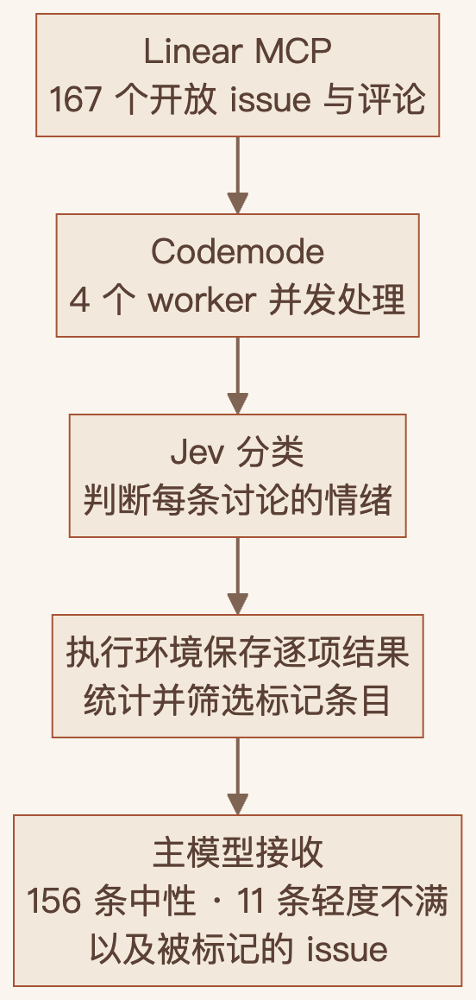
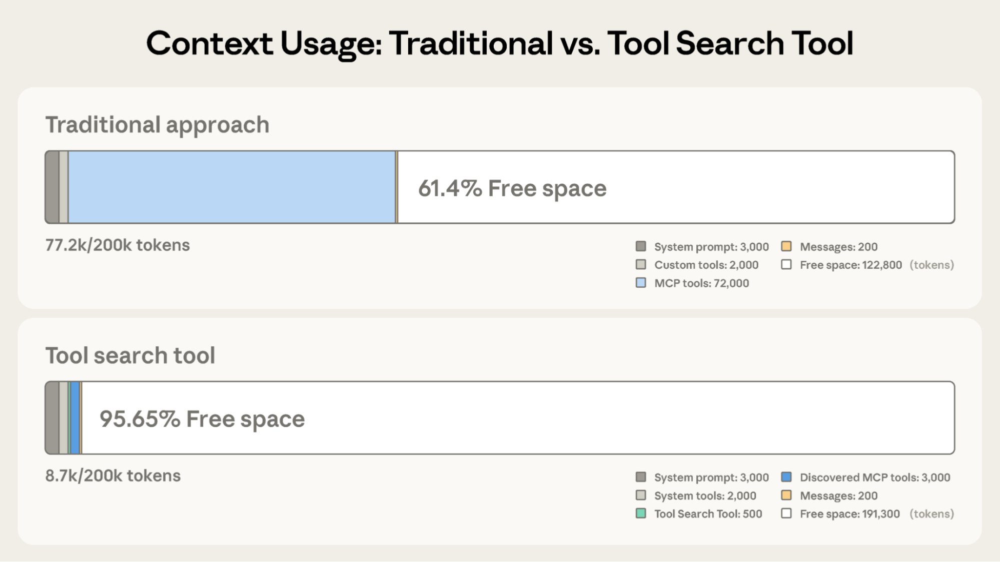
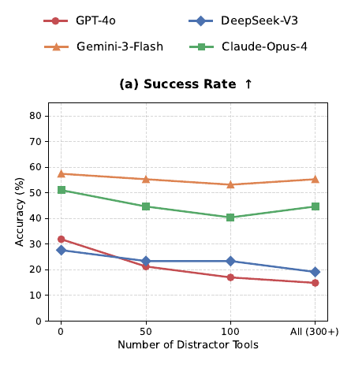
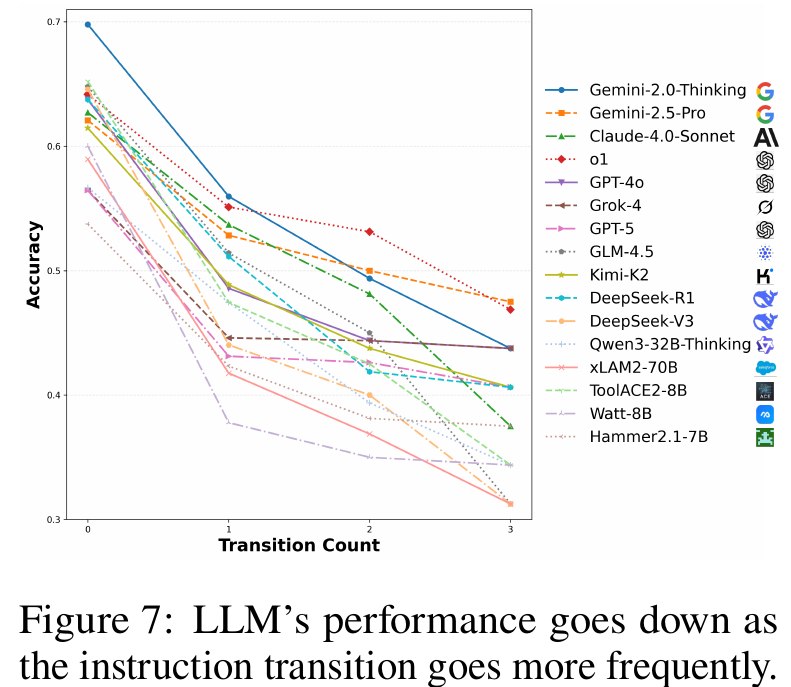
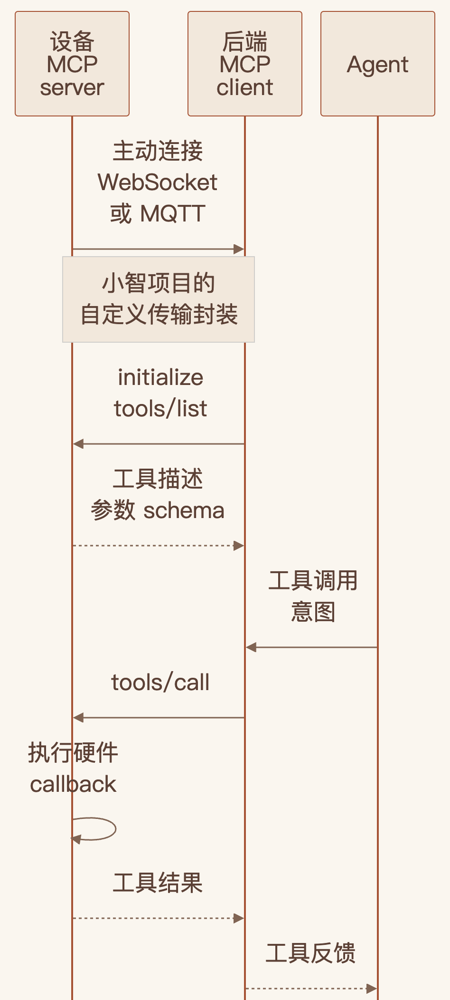

{
  "title": "Pi 为什么接纳 MCP，以及给我们的启发。",
  "author": "Echo",
  "description": "从 Pi 的极简设计与 MCP 接入，谈工具决策的成本、外部能力的复用，以及仍需解决的上下文问题。",
  "date": "2026-10-02",
  "slug": "pi-mcp",
  "draft": false,
  "tags": [
    "Agent",
    "MCP",
    "Context Engineering",
    "工程实践"
  ],
  "echoArticle": true,
  "ShowToc": true,
  "TocOpen": false,
  "ShowReadingTime": true,
  "ShowCodeCopyButtons": true,
  "lastmod": "2026-10-03",
  "echoFigureCaptions": true
}

Pi 发布 1.0，把 MCP 正式接进来了。[发布公告](https://earendil.com/posts/pi-1-0/)

读到这个消息，我想起了自己之前做 Agent 时的一个判断。工具应该少一点，schema 应该自己认真设计。MCP 接得越多，能力未必越强，上下文倒是很快变得拥挤。

所以，比起一句「Pi 也打脸自己了」，我更想知道，他们这次到底改变了什么。原来坚持的极简设计，还成立吗？

## 从四个工具开始

Pi 被更多人知道，有一条很清楚的传播路径。今年 1 月，OpenClaw 采用了 Pi，Armin Ronacher 也写文章介绍自己为什么喜欢这个小 Agent。[Armin 当时的文章](https://lucumr.pocoo.org/2026/1/31/pi/)

曝光之后，它对开发者的吸引力，还得看设计本身。早期 Pi 默认提供 `read`、`bash`、`edit`、`write` 四个工具，核心很小，同时允许使用者通过扩展增加能力。[Pi 作者的设计说明](https://mariozechner.at/posts/2025-11-30-pi-coding-agent/)

模型之外的对话循环、工具执行、上下文和扩展机制，由 harness 承担。Pi 帮开发者做好这一圈基础设施，再把应用需要哪些能力，留给开发者自己决定。

你可以从很少的工具开始，知道模型眼前到底有什么，再一点点增加。对需要调 prompt、磨工具描述、评测任务表现的人来说，这种可控性很重要。

## Pi 这次改变了什么

这轮更新里，与 MCP 关系最密切的是 Codemode 和延迟加载。循环、并发、过滤和汇总，可以在执行环境里完成，最后把需要的结果交给主模型。

Pi 官方给了一个具体例子：取出 Linear 上 167 个开放 issue 和各自的评论，让 Jev 判断讨论情绪。脚本用四个 worker 并发处理，保留完整分类结果，向主模型返回统计和被标记的 issue。

*图 1｜根据 [Pi 官方案例](https://earendil.com/posts/you-said-no-mcp/) 自绘。167 条讨论中，156 条被判为中性、11 条为轻度不满。*

MCP 提供外部接口，程序负责批量处理，分类模型完成专项判断。主模型不必逐条阅读全部中间数据。

为了让这些能力配合起来，Pi 需要区分哪些工具直接给模型、哪些延迟加载、哪些只交给 Codemode。原有扩展接口缺少足够的工具元数据，这轮改造也让 Jev 等模型更容易被使用。团队因此选择把 MCP 纳入核心，并参与改善它的使用方式。[官方解释](https://earendil.com/posts/you-said-no-mcp/)

这是应用需求变化之后的一次取舍。Codemode 提供组合能力，MCP 提供外部能力的共同接入契约。两者搭在一起很有用，但 Codemode 同样可以调用普通工具；任务效果还要看工具与执行流程的设计。[官方 CLI 文档](https://github.com/earendil-works/pi/blob/v1.0.0/packages/coding-agent/docs/cli.md#enable-codemode)

## 工具设计背后的上下文成本

我以前更愿意自己设计 toolcall schema，很少用 MCP，甚至一度觉得它一无是处。尤其是工具加载多了之后，多轮对话里的调用表现会明显下滑。增加的能力还没用上，关键任务先受了影响。

这也是为什么，我很能理解 Pi 早期的选择。去年 11 月，Pi 作者在[设计说明](https://mariozechner.at/posts/2025-11-30-pi-coding-agent/#no-mcp-support)里明确反对全量前置工具定义：当前任务用不到的说明书，也会挤占上下文。

同月，Anthropic 的工程文章记录了类似问题：五个 MCP server、58 个工具，仅定义就约占 55K tokens；相似工具还会增加选择和参数错误。这些顾虑，在 Pi 做出早期取舍时就已经存在。

*图 2｜Anthropic 的另一组预算示意：全量前置约占 77.2K tokens，按需发现约占 8.7K。来源：[官方工程文章](https://www.anthropic.com/engineering/advanced-tool-use)。*

今年的两项研究，则分别补充了工具干扰和多轮任务的证据。5 月发布的 ComplexMCP 保留任务所需工具，再逐步加入无关工具。GPT-4o、DeepSeek-V3 的任务成功率下降较明显，Gemini-3-Flash 的变化较小。工具干扰确实存在，模型承受它的能力不同。

*图 3｜ComplexMCP Figure 6(a)，截取成功率面板并重排图例。[完整原图](assets/complexmcp-figure6-original.png)与[论文](https://arxiv.org/html/2605.10787#S4.F6)。*

多轮任务还要维护用户约束、指代和先前结果。今年 2 月提交的 WildToolBench 中，随着后续任务的跨轮依赖增强，GPT-5 的任务准确率从第一项的 62.11% 降至第四项的 39.06%。

*图 4｜WildToolBench 原始 Figure 7；上文数字来自 [Table 2](assets/wildtoolbench-table2-original.png)，衡量任务所需的正确调用或适当回应。来源：[论文](https://arxiv.org/html/2604.06185v1)。*

实际落地时，还要把准确率放在延迟、成本和模型选择中一起考虑。备用模型与端侧小模型未必有同样的容错能力，减少不必要的工具判断，仍然是值得做的工程优化。

复杂但重复的处理可以交给程序，可独立完成的分析可以交给专项模型或 subagent。精简设计的价值，最终体现在模型完成任务时，需要承担多少决策负担。

## 从自建工具到复用外部能力

工具越多越好，我不认同。工具越少越好，我现在也不会轻易下这个结论。

因为做着做着，我遇到了另一类问题。真实业务需要的外部能力越来越多，而我考虑得更多的是模型的决策边界、工具的可插拔替换，以及长期可维护性。领域能力的开发者，则更关注功能本身是否完整、可靠。两边需要分工协作，我不可能为了统一这些工程细节，就把领域能力也全部亲自开发、维护一遍。

之前对 MCP 的判断，把两件事混在了一起。一件是模型每一步应该看到多少工具，另一件是别人开发的能力，怎样交给 Agent 使用。

第一件事，仍然要认真控制。第二件事，可以交给共同协议。客户端取得 MCP 工具目录之后，仍能决定向模型提供哪些定义；协议并没有要求把全部工具一次性放进上下文。[MCP 工具规范](https://modelcontextprotocol.io/specification/2026-07-28/server/tools)

在任务边界清楚、性能要求很细的场景里，优雅的 schema 仍然值得投入。名字、描述和参数，都会影响模型怎样理解工具。

同时，在很多垂直领域，最懂某个高价值功能的人，可能更适合定义这个功能的工具。他知道有哪些真实限制，怎样的输入有意义，什么样的结果能让后续动作继续。做 Agent 的人擅长控制上下文，也需要这些领域知识。

让熟悉能力的人负责把它做好，再通过 MCP 接进来。应用侧继续评测它在具体任务里怎样被使用，以及模型在什么时候需要看到它。

说个题外话，端侧能力也可以沿着这个思路接入。虽然 MCP 当前的标准传输主要是 stdio 和 Streamable HTTP，但它也允许自定义传输。[MCP 传输规范](https://modelcontextprotocol.io/specification/2026-07-28/basic/transports)

小智 ESP32 开源项目就为 MCP 做了 WebSocket／MQTT 传输封装。工具注册在设备上，设备通过 WebSocket 或 MQTT 连接后端，后端发现工具，再发起调用。设备提供工具，因此在 MCP 的角色里仍然是 server。

*图 5｜根据 [小智工具文档](https://github.com/78/xiaozhi-esp32/blob/main/docs/mcp-usage.md)与[协议说明](https://github.com/78/xiaozhi-esp32/blob/main/docs/mcp-protocol.md)自绘；[官方完整时序图](assets/07-xiaozhi-official-sequence.png)另附。*

硬件工程师可以把设备能力、参数和执行实现封装成 MCP server，Agent 根据契约调用，驱动细节仍由熟悉设备的人维护。也希望更多领域的工程师和专家尝试这种方式，把自己擅长的能力封装出来，让更多 Agent 能够使用。

这种分工允许开发者继续打磨自己的关键任务，同时复用领域团队持续维护的能力。极简的要求落在实际运行与模型所见的上下文里，也给外部能力留下接入空间。

## 能力接入之后

能力接进来了，上下文的污染和浪费依然存在。Pi 的编程与工具编排场景，让 Codemode 成为一条自然的路径：把中间处理留在执行环境，再返回必要结果。

换到低延迟交互、端侧小模型或其他行业任务，又该怎样处理工具膨胀与多轮 context rot？我想下次专题聊聊多工具落地的方案取舍。
